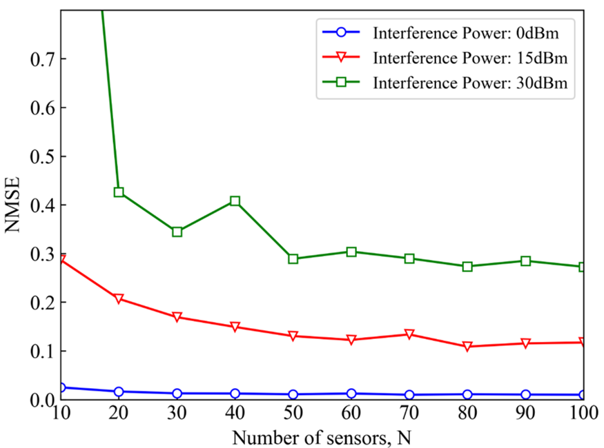

## Problem Set-up

We set up the following problem. We randomly distribute $2^{10}$ Rx radios in a $200 m \times 200m$ geographical area, $\mathcal{R}\subset\mathbb{R}$. We also employ two Tx radios. One transmits the desired signal; the other transmits interference. We first obtain the capacity at all the Tx-Rx pairs in an exact manner using [MIMObit](http://www.nebens.com/home/products).

<figure style="margin: auto auto; text-align: center; width:100%" vertical-align='middle'>
    

    Fig.1 System Model.
</figure>

Then, we use the capacity of a subset of Tx-Rx pairs as “training data” in a machine learning scheme and derive a “ML capacity model” which is used to estimate the capacity everywhere, not just at the location of the training Rx radios. We then compare the capacity estimated by the ML capacity model to the ‘exact’ capacity as calculated by MIMObit.

## Simulations and Results
All simulations in this paper are performed using a $times2$ MIMO scheme. Specifically, the signal Tx radio employs a $4$-port MEA consisting of two pairs of $\pm45^\circ$ halfwave dipoles $\lambda/2$ apart. The Rx antenna system consists of two halfwave vertical dipoles $\lambda/2$ apart. The “true” capacity in the area $200 m \times 200m$ is generated by solving the full problem using MIMObit and $2^{10}$ Rx radios. Then, the locations of sensors whose capacity is used as training data are selected randomly from those $2^{10}$ Rx radios. We evaluate the performance of the estimator versus interference power, number of sensors and propagation models. All analyses are carried out over WiFi frequency (2450MHz).

<figure style="margin: auto auto; text-align: center; width:100%" vertical-align='middle'>
    

    True and SVR estimated capacity of a 4×2 MIMO wifi system. The white crosses represent the locations of sensors.
</figure>

Fig. 2 shows the “true” and estimated capacity over the interested area. The number of sensors is 90, about 9% of the RX radios. The estimated capacity matches well the true one.

To measure the estimation performance, the normalized mean square error (NMSE) is defined as:
$$
NMSE:=\frac{E\{\Vert f(x)-\hat{f}(x)\Vert^{2}\}}{E\{\Vert f(x)\Vert ^{2}\}}
$$

### Estimation performance of SVR
<figure style="margin: auto auto; text-align: center; width:100%" vertical-align='middle'>
    

    Fig.3 SVR estimated capacity NMSE (three interference power values).
</figure>

Fig. 3 depicts the NMSE for different values of N and interference power. The propagation model is set as TGn-B. The total interference power is 0 dBm, 15 dBm and 30 dBm, respectively. It can be seen that the performance improves with N for different interference power values and the NMSE of lower interference has better performance. Here the reason is that higher interference resulted in more complex features, which are difficult to capture with SVR.

<figure style="margin: auto auto; text-align: center; width:100%" vertical-align='middle'>
    

    Fig.4 SVR estimated capacity NMSE for different propagation models.
</figure>

To illustrate the effects of scene complexity, Fig. 4 shows the NMSE as a function of N for different propagation models. Flat-Earth is a two-ray model and line-of-sight (LOS) corresponds to direct path propagation. Both of these models are simple and deterministic. While TGn-B is an indoor IEEE WiFi propagation model comprised of two random clusters of plane waves [16]. The first cluster has five plane waves, while the second has seven. The SVR runs better when the actual model is simple. As anticipated, the NMSEs are larger for TGn-B as compared to LOS and Flat-Earth. This is because the LOS and Flat-Earth models are deterministic and just a couple of parameters can capture their physics. However, in the TGn-B model, even though its major attributes are governed by given statistics, the specific instantiations are random and, thus, its physical behavior is not as easily captured.

### Performance Comparison of SVR and GPR
<figure style="margin: auto auto; text-align: center; width:100%" vertical-align='middle'>
    

    Fig.5 Comparison of SVR and GPR.
</figure>

Similarly to SVR, Gaussian process regression (GPR) is another kernel-based machine learning algorithm. The solid lines represent the SVR algorithm and the dashed lines represent GPR algorithm. Different colors correspond to different channel models or interference powers. Whether we focus on performance for different propagation models or for different interference power, Support vector regression is always better than Gaussian process regression.

## Conclusions

A study of capacity estimation in MIMO wireless system using the SVR algorithm is pursued. The performance of the estimator is tested from different aspects, including interference power, propagation model and the number of the training data. It is found that the cartography of capacity for such a MIMO link is feasible with an appreciable accuracy even when using just 10% of data for training. Although deterministic propagation environments are easy to model, empirical propagation models characterized by a degree of randomness are also adequately models with a small percentage of training data.