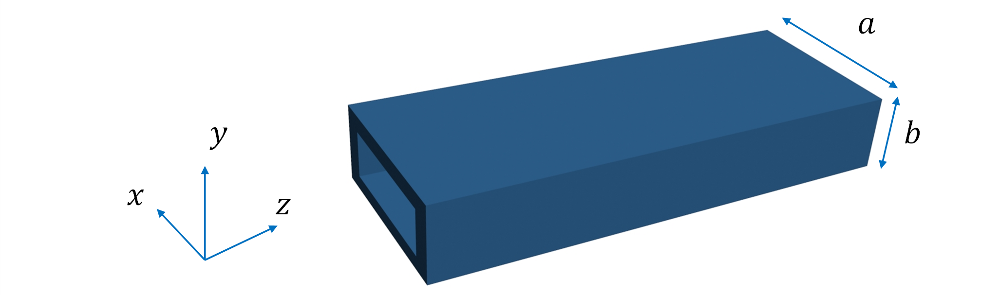
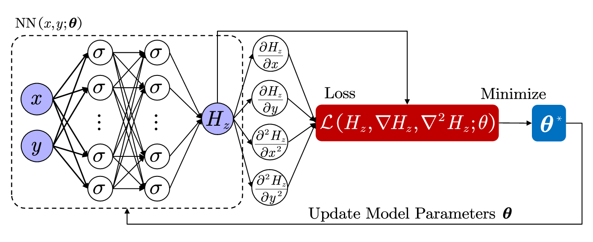
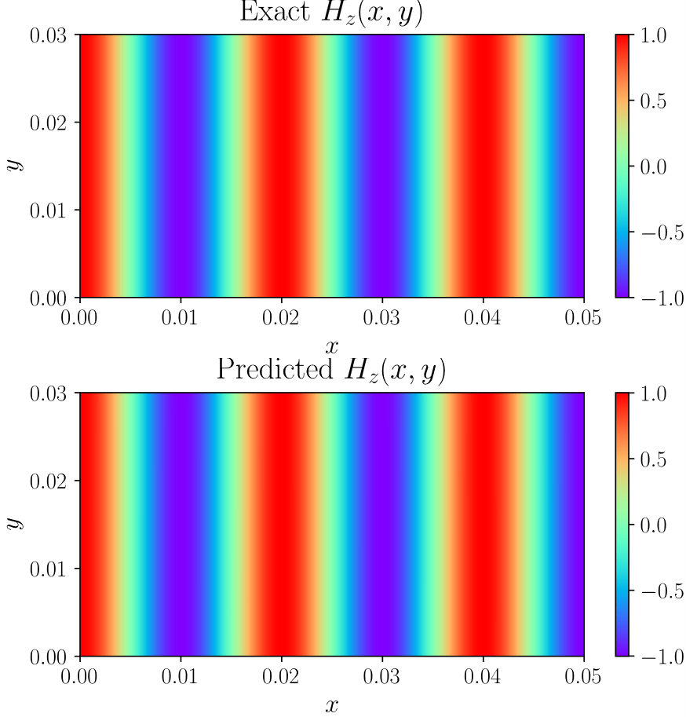
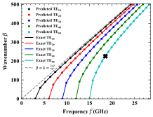
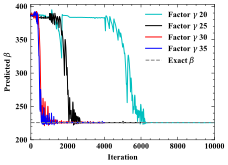

## Introduction
Over the past few years, deep learning has been used very successfully in a broad range of applications including computer vision [1], natural language processing and cognitive sciences [2]. In these applications, large amounts of data are needed to train the neural network by minimizing the distance (loss) between the network output and the ground truth [3]. In many instances of analyzing physical systems [4], the cost of data acquisition is high, but the physical laws of the system are known to us. To empower the network model with known physical laws, Raissi et al. [5] proposed Physics Informed Neural Networks (PINNs), which aims to solve direct and inverse problems governed by several different types of PDEs. The loss function of a PINN consists of several terms, including different governing equations and boundary conditions. In particular, the training data used in this framework can be sampled from the domain of definition. 

PINNs have been used for solving direct and inverse problems governed by PDEs in various fields, such as material science [6] and fluid mechanics [7]. In this paper, we focus on the application of PINNs to solve the mode problem in rectangular waveguides [8]. Our intention here is not to substitute the traditional solutions to eigenvalue problems [9].  Rather, we aim at investigating the applicability of PINNs to well-known electromagnetic boundary value problems [10].

## Problem Set-Up and Mehthodology

### A. Rectangular Waveguide Problem

<figure style="margin: auto auto; text-align: center; width:100%" vertical-align='middle'>
    

    Fig.1 Geometry of the rectangular waveguide.
</figure>

Consider a rectangular waveguide problem represented in Fig. 1, where a and b are the width and the height of the rectangular cross section, respectively. Seeking solutions representing propagating waves along the waveguide, the z component of the magnetic fields is given by $H_z\left(x,y,z\right) = H_z\left(x,y\right)e^{-j\beta z}$. Let $\Omega\in\mathbb{R}^2$, then the original 3-D problem reduces to a 2-D Helmholtz equation:

$$
\frac{\partial^2H_z}{\partial x^2}+\frac{\partial^2H_z}{\partial y^2}+\left(k^2-\beta^2\right)H_z=0,\ \forall x,y\in\Omega. \tag{1}
$$

where $k=2\pi f/c$,  $f$ is the frequency, $c$ is the speed of sound, $H_z\equiv H_z\left(x,y\right)$ is the unknown 2-D field and $\beta$ is the unknown wavenumber. The object of this study is to solve for $H_z\left(x,y\right)$ and $\beta$ using PINNs. 

As a special case, we restrict ourselves to the Transverse Electric,  ${TE}_{mn}$, modes, which have $E_z=0$. All other components of electromagnetic (EM) fields can be derived from Hz using the following equations

$$
\left[\begin{matrix}E_x\\E_y\\\end{matrix}\right]=\frac{j\omega\mu}{k^2-\beta^2}\left[\begin{matrix}-\frac{\partial H_z}{\partial y}\\\frac{\partial H_z}{\partial x}\\\end{matrix}\right]  \tag{2}
$$

$$
\left[\begin{matrix}H_x\\H_y\\\end{matrix}\right]=-\frac{j\beta}{k^2-\beta^2}\left[\begin{matrix}\frac{\partial H_z}{\partial x}\\\frac{\partial H_z}{\partial y}\\\end{matrix}\right] \tag{3}
$$

The pertinent boundary conditions (BC) are 
$$
E_x\left(x,0\right)=E_x\left(x,b\right)=0  \tag{4}
$$

$$
E_y\left(0,y\right)=E_y\left(a,y\right)=0  \tag{5}
$$

In order to investigate the applicability of PINNs to this problem, we choose to excite the waveguide with a current distribution which we know is going to generate pure TEm0 modes.  Thus, $H_x$ is specified by

$$
H_x\left(x,y\right)=J_{sy}sin\left(\frac{m\pi}{a}x\right),\forall x,y\in\Omega.  \tag{6}
$$

where $J_{sy}$ is an arbitrary amplitude. From equations (2-5), we can obtain the constrains on $H_z$

$$
\frac{\partial H_z}{\partial x}=J_{sy}\frac{k^2-\beta^2}{-j\beta}sin\left(\frac{m\pi}{a}x\right),\ \forall x,y\in\Omega.  \tag{7}
$$

$$
\frac{\partial H_z}{\partial x}=0,\ at\ y=0\ and\ y=b  \tag{8}
$$

$$
\frac{\partial H_z}{\partial y}=0,\ at\ x=0\ and\ x=a  \tag{9}
$$

The well-known and exact wavenumber, $\beta$, is given by

$$
\beta=\sqrt{k^2-\left(\frac{m\pi}{a}\right)-(\frac{n\pi}{b})}  \tag{10}
$$

By combining \eqref{exey} - \eqref{hx_xy} we can obtain the exact $H_z$

$$
H_z\left(x,y\right)=\frac{k^2-\beta^2}{j\beta}\frac{\alpha}{m\pi}J_{sy}\cos(\frac{m\pi}{a}x)  \tag{11}
$$

### B. Introduction to Physics-Informed Neural Network

<figure style="margin: auto auto; text-align: center; width:100%" vertical-align='middle'>
    

    Fig.2 Schematic of a PINN for solving rectangular waveguide problem.
</figure>

In this section, we briefly review the architecture of PINNs, following prior published work [5]. Let $\mathcal{N}^L\left(\mathbf{x};\mathbf{W},\mathbf{b}\right):\mathbb{R}^{d_{in}}\rightarrow\mathbb{R}^{d_{out}}$ be an $L-layer$ neural network with input vector $\mathbf{x}$, network parameters $\mathbf{W}$,$\mathbf{b}$ and $N_\ell$ neurons in the $\ell-th$ layer $(N_0=d_{in},\ N_L=d_{out})$. In this study, we use the feedforward neural network (FNN) [11], which is defined as follows

$$
\mathcal{N}^0(\mathbf{x})=\mathbf{x}\in\mathbb{R}^{d_{in}} \tag{12}
$$

$$
\mathcal{N}^\ell(\mathbf{x})=\sigma^\ell(\mathbf{W}^\ell\mathcal{N}^{\ell-1}(\mathbf{x})+\mathbf{b}^\ell), for 0<\ell<L	\tag{13}
$$

$$
\mathcal{N}^\ell(\mathbf{x})=\mathbf{W}^L\mathcal{N}^{L-1}(\mathbf{x})+\mathbf{b}^L\in\mathbb{R}^{d_{out}}	\tag{14}
$$

where $\mathcal{N}^0(\mathbf{x})\equiv\mathbf{x}$ is the input vector. $\mathbf{W}^\ell\in\mathbb{R}^{N_\ell\times N_{\ell-1}}$, $\mathbf{b}^\ell\in\mathbb{R}^{N_\ell}$ are the weight matrix and bias vector in $\ell-th$ layer, respectively. The function $\sigma^\ell$ denotes the nonlinear activation function in layer $\ell$, which operates element-wise.

In Fig. 2 we show the architecture of PINNs. The left part FNN$(x,y;\mathbf{\theta})$ takes coordinates $(x,y)$ as inputs and is trained to predict the solution $H_z$, where $\mathbf{\theta}=\left\{{\mathbf{W}^\ell,\mathbf{b}^\ell}\right\}_{\ell=0}^L$ represents the trainable parameters in the network. By applying the chain rule, the derivatives of $H_z$ with respect to the inputs can be computed automatically [12]. Then the parameters $\mathbf{\theta}$ of the neural network can be learned by minimizing the mean squared error loss

$$
L=L_{PDE}+L_{data}+\lambda L_{BC}	\tag{15}
$$

$$
L_{P D E}=\left\|\frac{\partial^{2} H_{z}}{\partial x^{2}}+\frac{\partial^{2} H_{z}}{\partial y^{2}}+\left(k^{2}-\beta^{2}\right) H_{z}\right\|_{2}^{2},(x, y) \in \Omega  \tag{16}
$$

$$
L_{\text {data}}=\left\|\frac{\partial H_{z}}{\partial x}-J_{s y} \frac{k^{2}-\beta^{2}}{-j \beta} \sin \left(\frac{m \pi}{a} x\right)\right\|_{2}^{2},(x, y) \in \Omega  \tag{17}
$$

$$
L_{B C}=\left\|\frac{\partial H_{z}}{\partial x}\right\|_{2}^{2}+\left\|\frac{\partial H_{z}}{\partial y}\right\|_{2}^{2},(x, y) \in \partial \Omega  \tag{18}
$$

where $L_{data}$ is given by equation (7), $L_{PDE}$ and $L_{BC}$ are the loss components corresponding to the residual of Helmholtz equation (1) and boundary conditions, respectively. The constant $\lambda$ is the weight of $L_{BC}$ and $\partial\Omega$ is the boundary (not to be confused with the wavelength).

To accelerate the training of Neural Network, the input vector is multiplied by a scaling factor, $\gamma$
$$
\mathbf{x}^\ast=\gamma\mathbf{x} 	\tag{19}
$$

where vector \mathbf{x} presents the original 2-D coordinates $(x,y)$ and $\mathbf{x}^\ast$ is the scaling coordinates.  The wavenumber result is then scaled back appropriately.

## Results and Discussion

<figure style="margin: auto auto; text-align: center; width:100%" vertical-align='middle'>
    

    Fig.3 Exact normalized solution versus the predicted solution of PINN.
</figure>

In this section we provide a collection of numerical tests on solving rectangular waveguide problem with PINNs. Consider a computational domain of $\left[0,a\right]\times\left[0,b\right]=\left[0,\ 0.05m\right]\times\left[0,\ 0.03m\right]$, we solve waveguide problem governed by Helmholtz equation and estimate the unknown wavenumber . The performance of PINNs with scaling inputs is evaluated in terms of the convergence speed and the accuracy. For computing the total loss, we randomly select the position of training points. In all experiments, the training of PINNs is performed using FNN with 4 layers, each with 50 neurons. The numbers of training points in the domain and on the boundary are 10,000 and 600, respectively. Moreover, we employ sinusoidal activation functions and train the networks using the Adam optimizer [13] with learning rate 1e-4. We set the weight of boundary condition $\lambda=20$, scaling factor of input vector \gamma=30. All algorithms are implemented in PyTorch [14] and the computations are performed on a single Nvidia 2080Ti GPU. 

Fig. 3 provides a comparison between the ground truth Hz field component solution and the predicted one, obtained after 4000 iterations at TE50 mode. We use frequency $f=27.57\ GHz$ in this mode. The results show that the predicted solution achieves very good agreement with the exact one and the prediction error is measured at 7.63e-05 in the relative $L^2-$norm. The exact $\beta$ is 482.87 rad/m and the predicted $\beta$ is 482.83 rad/m. For this experiment, the PINNs are trained for 4000 iterations requiring approximately 4 minutes.

<figure style="margin: auto auto; text-align: center; width:100%" vertical-align='middle'>
    

    Fig.4 Exact and predicted dispersion relations for different TE modes..
</figure>

Fig. 4 depicts the predicted and exact dispersion relations for different $TE$ modes. The number of iterations required for all these results is less than 20,000 and the errors between the predicted $\beta$ and the exact $\beta$ are all lower than 1%. We observe that the convergence of PINNs becomes slower when the frequency f is set close to the cutoff frequency. The thick black “x” indicates the point on the dispersion curve where the convergence study shown in Fig. 5 has been conducted.

<figure style="margin: auto auto; text-align: center; width:100%" vertical-align='middle'>
    

    Fig.5 Convergence of predicted β for different scaling factors at TE50 mode.
</figure>

Fig. 5 shows the convergence of the wavenumber as a function of the scaling factor used in the numerical calculations. Before training, the initial value of $\beta$ is set to k. The results show the predicted $\beta$ can converge to the exact value after up to 6000 iterations if the scaling factor is in the range of 20~35. We find that PINNs with $\gamma=1$ fail to solve this waveguide problem at ${TE}_{50}$ mode. For ${TE}_{10}$ mode, PINNs with$\ \gamma=1$ need to be trained for approximately 1,000,000 iterations to get solutions. This indicates that the scaling factor greatly speeds up the training. This peculiarity is reminiscent of observations by other researchers [15] and further studies are in progress to better understand it. It is interesting to note that, regardless of the value of the scaling factor, the convergence of the wavenumber is not smooth.

## Conclusions
We investigated the applicability of  PINNs to the rectangular waveguide problem. We excited a rectangular waveguide so as to generate $TE_z$ modes and, specifically, the first few of the $n=0$ modes (i.e. no variation on the y-axis). We demonstrated that PINNs indeed can be applied to solve this problem.  We further identified the importance of a scaling technique in the convergence of the numerical results.  Additional studies are required to better characterize the mechanics of this convergence.